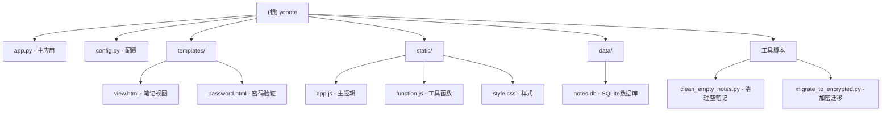

# YoNote - 在线 Markdown 笔记应用

## 变更记录 (Changelog)

| 日期 | 操作 | 描述 |
|------|------|------|
| 2026-01-20 | 功能增强 | Markdown 编辑器增强：任务列表、脚注、高亮、上标/下标；分栏拖拽调整；设置页面美化；HTTPS 分享链接修复 |
| 2026-01-20 | 安全修复 | 修复 Markdown XSS 漏洞，添加 bleach HTML 清理；修复代码质量问题 |
| 2026-01-20 | 添加 | 配置 GitHub Actions CI/CD 自动化流程 |
| 2026-01-20 | 创建 | 初始化项目文档，完成全面扫描 |

---

## 项目愿景

YoNote 是一个轻量级的在线 Markdown 笔记应用，支持实时预览、自动保存、密码保护和内容加密。用户可以通过简短的 URL 快速创建和分享笔记，无需注册登录。

## 架构总览

```
+------------------+     +------------------+     +------------------+
|    前端界面       |     |   Flask 后端     |     |   SQLite 数据库   |
|  (HTML/CSS/JS)   | <-> |   (Python)       | <-> |   (notes.db)     |
+------------------+     +------------------+     +------------------+
                              |
                              v
                    +------------------+
                    |   内容加密层       |
                    |   (Fernet/AES)   |
                    +------------------+
```

### 技术栈

| 层级 | 技术 |
|------|------|
| 后端框架 | Flask 2.0.1 |
| 数据库 | SQLite 3 |
| 加密 | Fernet (PBKDF2HMAC + AES) |
| XSS 防护 | bleach (HTML 清理) |
| Markdown 渲染 | Python-Markdown + pymdown-extensions (任务列表、脚注、高亮、上标/下标) |
| 前端渲染 | Marked.js, KaTeX, Highlight.js |
| 容器化 | Docker + Supervisor |
| CI/CD | GitHub Actions |
| 代码检查 | Ruff |

## 模块结构图



## 模块索引

| 模块/文件 | 职责 | 入口 |
|----------|------|------|
| `app.py` | Flask 主应用，包含所有路由和业务逻辑 | `python app.py` |
| `config.py` | 配置类，定义密钥、会话、CSP 等设置 | 被 app.py 引用 |
| `templates/` | Jinja2 HTML 模板 | 被 Flask 渲染 |
| `static/` | 前端静态资源 (JS/CSS) | HTTP 静态服务 |
| `clean_empty_notes.py` | 定时任务：清理 24 小时前的空笔记 | cron 调度 |
| `migrate_to_encrypted.py` | 数据迁移：将旧笔记加密 | 手动运行 |

## 运行与开发

### 本地开发

```bash
# 安装依赖
pip install -r requirements.txt

# 运行开发服务器
python app.py
# 服务运行在 http://localhost:5005
```

### Docker 部署

```bash
# 构建并启动
docker-compose up -d

# 查看日志
docker logs -f yonote
```

### 环境变量

| 变量名 | 说明 | 默认值 |
|--------|------|--------|
| `SECRET_KEY` | Flask 会话密钥 | `dev_key_please_change` |
| `ENCRYPTION_KEY` | 笔记加密密钥 | `this_is_a_secret_key...` |
| `ENCRYPTION_SALT` | 加密盐值 | `static_salt_change_this` |

## API 路由

| 路由 | 方法 | 功能 |
|------|------|------|
| `/` | GET | 创建新笔记并重定向 |
| `/<key>` | GET | 查看/编辑笔记 |
| `/<key>/update` | POST | 更新笔记内容和设置 |
| `/<key>/auto-save` | POST | 自动保存 (JSON) |
| `/<key>/verify` | POST | 验证笔记密码 |
| `/<key>/delete` | GET | 删除笔记 |
| `/<key>/download` | GET | 下载笔记为 txt |
| `/render-markdown` | POST | 服务端 Markdown 渲染 |
| `/<key>/get-timestamp` | GET | 获取笔记更新时间 |

## 数据模型

### notes 表

```sql
CREATE TABLE notes (
    id INTEGER PRIMARY KEY AUTOINCREMENT,
    key TEXT UNIQUE NOT NULL,        -- 笔记短链接标识 (3-7位字母)
    content TEXT NOT NULL,           -- 加密后的笔记内容
    password TEXT,                   -- SHA256 哈希密码
    public BOOLEAN DEFAULT 0,        -- 是否公开可读
    created_at INTEGER NOT NULL,     -- 创建时间戳
    updated_at INTEGER NOT NULL,     -- 更新时间戳
    encrypted BOOLEAN DEFAULT 1      -- 是否已加密
);
```

### lockouts 表

```sql
CREATE TABLE lockouts (
    key TEXT PRIMARY KEY,            -- 笔记标识
    ip_address TEXT NOT NULL,        -- 锁定的 IP 地址
    locked_until INTEGER NOT NULL    -- 锁定结束时间戳
);
```

## 安全机制

1. **内容加密**: 使用 Fernet 对笔记内容进行 AES 加密存储
2. **密码保护**: 笔记可设置 SHA256 哈希密码
3. **访问控制**: 三种模式 - 公开、受保护公开、私有
4. **暴力破解防护**: 5 次错误锁定 30 分钟
5. **速率限制**: 每日 2,000,000 / 每小时 50,000 请求上限
6. **会话管理**: HTTP-only、Secure、SameSite Cookie
7. **XSS 防护**: 使用 bleach 库清理 Markdown 渲染的 HTML 输出
8. **安全随机数**: 笔记 key 使用 `secrets` 模块生成 (CSPRNG)

### XSS 防护详情

Markdown 渲染通过 `render_markdown_safe()` 函数处理：

```python
# 允许的 HTML 标签白名单
ALLOWED_TAGS = ['p', 'br', 'h1', 'h2', 'h3', 'h4', 'h5', 'h6',
                'ul', 'ol', 'li', 'code', 'pre', 'table', ...]

# 允许的属性白名单
ALLOWED_ATTRS = {
    'a': ['href', 'title', 'target', 'rel'],
    'img': ['src', 'alt', 'title', 'width', 'height'],
    ...
}

# 清理流程：Markdown → HTML → bleach.clean() → 安全输出
```

**防护效果：**
- `<script>` 标签被移除
- `onerror`、`onclick` 等事件属性被移除
- `javascript:` 协议链接被清理

## 前端功能

- **实时预览**: 左右分栏编辑/预览 (PC)，切换模式 (移动端)
- **自动保存**: 输入停止 1 秒后自动保存
- **Markdown 渲染**: 支持表格、代码高亮、数学公式 (KaTeX/MathJax)
- **响应式设计**: 适配桌面和移动设备

## 测试策略

> 当前项目未包含自动化测试文件。建议后续添加：
> - 单元测试：`pytest` + `pytest-flask`
> - API 测试：测试各路由的正常和异常情况
> - 加密测试：验证加解密一致性

## 编码规范

- **Python**: 遵循 PEP 8，使用中文注释
- **JavaScript**: ES6+ 语法，使用 `const`/`let`
- **CSS**: BEM 命名风格，响应式优先

## CI/CD 流程

项目使用 GitHub Actions 实现自动化 CI/CD：

### 工作流文件

| 文件 | 触发条件 | 功能 |
|------|----------|------|
| `.github/workflows/ci.yml` | push/PR 到 main/master/develop | 代码检查、安全扫描、测试 |
| `.github/workflows/docker.yml` | push/PR 到 main/master、tag 发布 | Docker 镜像构建与推送 |

### CI 流程

1. **代码检查 (lint)**
   - Ruff 代码检查和格式验证

2. **安全扫描 (security)**
   - Bandit 静态安全分析
   - Safety 依赖漏洞检查

3. **测试 (test)**
   - pytest 单元测试 (如有)
   - 验证 Flask 应用可启动

### Docker 流程

1. 构建 Docker 镜像
2. 推送到 GitHub Container Registry (ghcr.io)
3. 支持语义化版本标签 (v1.0.0)

### 本地代码检查

```bash
# 安装 Ruff
pip install ruff

# 代码检查
ruff check .

# 格式检查
ruff format --check .

# 自动修复
ruff check --fix .
```

## AI 使用指引

### 常见任务

1. **添加新 API**: 在 `app.py` 中添加路由函数，遵循现有模式
2. **修改前端**: 编辑 `static/app.js` 和 `static/style.css`
3. **修改模板**: 编辑 `templates/view.html`

### 注意事项

- 修改加密相关代码时，注意保持与现有数据的兼容性
- 修改数据库结构需提供迁移脚本
- 前端修改需测试 PC 和移动端两种布局

## 相关文件清单

```
yonote/
+-- app.py                    # Flask 主应用 (613 行)
+-- config.py                 # 配置类 (35 行)
+-- requirements.txt          # Python 依赖
+-- pyproject.toml            # Ruff 代码检查配置
+-- Dockerfile                # Docker 构建文件
+-- docker-compose.yml        # Docker Compose 配置
+-- clean_empty_notes.py      # 空笔记清理脚本
+-- migrate_to_encrypted.py   # 加密迁移脚本
+-- .github/
|   +-- workflows/
|       +-- ci.yml            # CI 工作流 (代码检查、安全扫描、测试)
|       +-- docker.yml        # Docker 构建工作流
+-- templates/
|   +-- view.html             # 笔记主视图模板
|   +-- password.html         # 密码验证页面
|   +-- favicon.png           # 网站图标
+-- static/
|   +-- app.js                # 前端主逻辑 (695 行)
|   +-- function.js           # 工具函数 (185 行)
|   +-- style.css             # 样式表 (1368 行)
|   +-- favicon.ico           # 网站图标
+-- data/
    +-- notes.db              # SQLite 数据库
```
